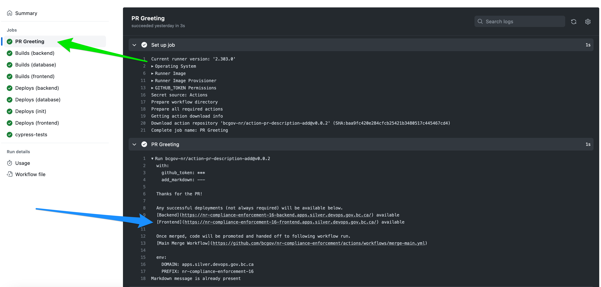
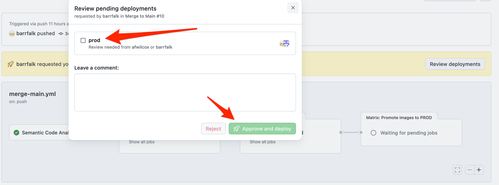
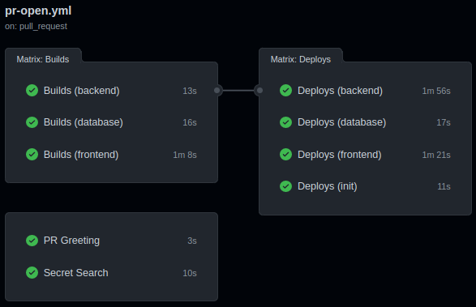
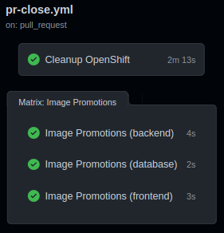
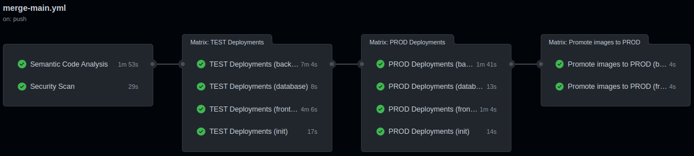
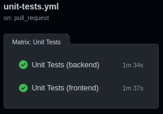

<!-- Project Shields -->

# Compliance and Enforcement: OpenShift, TypeScript and Postgres/PostGIS

Manages public complaints as well as investigative case files for multiple Compliance and Enforcement divisions across the natural resource sector.

Dev URLs:
Test URL: https://nr-compliance-enforcement-test-frontend.apps.silver.devops.gov.bc.ca/
Prod URL: tbd

Pipelines are run using [GitHub Actions](https://github.com/bcgov/nr-compliance-enforcement/actions).

Features:

- Pull Request-based pipeline
- Sandboxed development deployments
- Gated production deployments
- Container publishing (ghcr.io) and importing (OpenShift)
- Security, vulnerability, infrastructure and container scan tools
- Automatic Dependabot dependency patching with Pull Requests
- Enforced code reviews and pipeline checks
- Templates and setup documentation
- Starter TypeScript application stack
- Playwright e2e test suites

# Environments

The workflows are triggered via github actions, and allow the migration of the application through the dev, test, and production Openshift environments. The term "dev" is a Ministry Openshift naming standard, and can be thought of as a "delivery" environment.

## Dev Environment

The Openshift dev environment is the environment in which the application is prepared and packaged for deployment. It is a staging environment where the latest code changes are integrated, compiled, and tested in Openshift to ensure that they are ready for deployment to the upper tier environments (test and prod). Several automated tests are performed here, which will help the code reviewer to verify that the application is behaving as expected, eliminating the need for the code reviewer to setup the application in their own environment.

Multiple sandboxed applications can be deployed here simultaneously, each associated with a pull request. This allows developers to verify that their changes are in a deployable state. The sandboxed application is deleted once migrated to test.

## Test environment:

The test environment is where the software is tested thoroughly before deployment to production. It is designed to replicate the production environment as closely as possible and is used to run various types of tests such as unit tests, integration tests, performance tests, and acceptance tests. This environment helps ensure that the software meets the required quality standards and that it is stable and reliable.

## Production environment:

The production environment is the live environment where the software is deployed and used by end-users. It is the final destination for the software and is where it will be accessed and used by customers. The production environment must be carefully managed and maintained to ensure the software remains available, stable, and secure.

In summary, the delivery environment is where software is prepared for deployment, the test environment is where software is tested to ensure it is reliable, and the production environment is where the software is deployed and used by end-users.

# Workflows

An initial pull request will deploy the application to a sandboxed deployment environment in Openshift's dev namespace. There can be multiple instances of the application running in this environment, each related to different pull requests. Refering to the github actions page (https://github.com/bcgov/nr-compliance-enforcement/actions), developers can review the automated actions that are triggered by a pull request. Each additional commit to the same pull request will trigger additional workflow runs, each using the same sandboxed deployment environment dedicated to the individual pull request.

Each pull request will automatically create a comment on the pull request itself indicating how to access the URL of the sandboxed environment associated with the pull request. For example, clicking on a pull request will display something similar to the following:

Note the hyperlink named "Frontend". This will open up the application in the dev sandboxed environment.

Github protection rules have been setup to require an approval before a pull request is merged into main. Developers cannot approve their own pull request.

Approving the pull request will trigger a migration request to TEST. To complete the migration, an approved member of the team will need to review and approve the deployment.

Similarly, once deployed to test, there is an option to approve the migration to production.

## Pull Request Opened

Runs on pull request submission. Also runs if new commits are made on existing pull request.

- Provides safe, sandboxed deployment environments
- Build action pushes to GitHub Container Registry (ghcr.io)
- Build triggers select new builds vs reusing builds
- Deployment includes curl checks and optional penetration tests
- Other checks and updates as required
- Playwright e2e test

## Pull Request Closed

Runs on pull request close or merge.

- Cleans up OpenShift objects/artifacts
- Merge promotes successful build images to TEST

## Merge to Main

Runs on merge to main branch.

- Code scanning and reporting to GitHub Security overview
- Zero-downtime\* TEST deployment
- Penetration tests on TEST deployment
- Zero-downtime\* PROD deployment.
- Labels successful deployment images as PROD
- Guarded migrations to test and production. Each require a review

\* excludes database changes

## Unit Tests

Runs on pull request submission or merge to main.

- Unit tests (should include coverage)
- Optionally, report results to Sonarcloud

## Playwright Tests

Automated user interaction tests are executed on pull requests. A link to playwright report (including relevant traces) is automatically added to the pull request. Note that the tests are run by ArgoCD after the GitHub actions have completed, so the link will not be functional until the CI/CD is complete.

# Feedback

Please contribute your ideas! [Issues](/../../issues) and [Pull Requests](/../../pulls) are appreciated.

# Acknowledgements

This Action is provided courtesty of the Forestry Suite of Applications, part of the Government of British Columbia.
