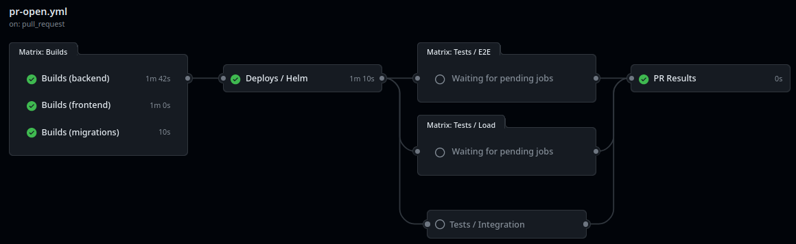
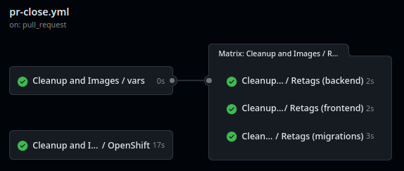
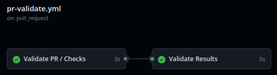
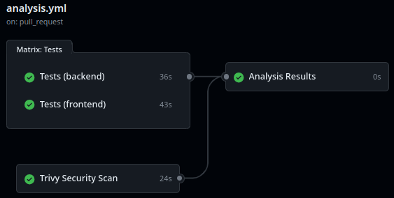

<!-- Project Shields -->

[](https://sonarcloud.io/summary/new_code?id=bcgov_nr-compliance-enforcement)
[](https://github.com/bcgov/nr-compliance-enforcement/actions/workflows/release-main.yml)
[](https://github.com/bcgov/nr-compliance-enforcement/actions/workflows/analysis.yml)

[](/../../issues)
[](/../../pulls)
[](/LICENSE.md)
[](https://github.com/bcgov/repomountie/blob/master/doc/lifecycle-badges.md)

# Compliance and Enforcement

Manages public complaints as well as investigative case files for multiple Compliance and Enforcement divisions across the natural resource sector.

**URLs:**

- Dev: https://f208ae-dev-X-natsuite-frontend.apps.emerald.devops.gov.bc.ca/
- Test: https://test.natsuite.nrs.gov.bc.ca/
- Prod: https://natsuite.nrs.gov.bc.ca/

Pipelines are run using [GitHub Actions](https://github.com/bcgov/nr-compliance-enforcement/actions).

## Features

- Pull Request-based pipeline
- Sandboxed development deployments
- Gated production deployments
- Container publishing (ghcr.io) and importing (OpenShift)
- Security, vulnerability, infrastructure and container scan tools
- Automatic Dependabot dependency patching with Pull Requests
- Enforced code reviews and pipeline checks
- Templates and setup documentation
- TypeScript application stack with React frontend and NestJS backends
- Playwright e2e test suites
- GraphQL API with Prisma ORM
- NATS messaging for event-driven architecture

## Project Structure

| Directory                      | Description                                                                                | README                            |
| ------------------------------ | ------------------------------------------------------------------------------------------ | --------------------------------- |
| `frontend/`                    | React/Vite frontend application                                                            | [📖](frontend/README.md)          |
| `backend/`                     | NestJS REST API (TypeORM) - complaint backend                                              |                                   |
| `backend-cm/`                  | NestJS GraphQL API (Prisma) - case management (Shared, Outcome, Investigation, Inspection) |                                   |
| `webeoc/`                      | NestJS service for WebEOC integration                                                      |                                   |
| `event-worker/`                | NestJS event processing worker (NATS consumer)                                             |                                   |
| `database/`                    | PostgreSQL/PostGIS database setup                                                          |                                   |
| `migration-complaint/`         | Flyway migrations - complaint schema                                                       |                                   |
| `migration-complaint-outcome/` | Flyway migrations - complaint_outcome schema                                               |                                   |
| `migration-investigation/`     | Flyway migrations - investigation schema                                                   |                                   |
| `migration-inspection/`        | Flyway migrations - inspection schema                                                      |                                   |
| `migration-shared/`            | Flyway migrations - shared schema                                                          |                                   |
| `exports/`                     | SQL export scripts                                                                         |                                   |
| `performance_tests/`           | K6 performance test scripts                                                                | [📖](performance_tests/README.md) |
| `tools/`                       | Terraform and utility scripts                                                              | [📖](tools/gitops/README.md)      |

## Tech Stack

| Component            | Technology                                                                  |
| -------------------- | --------------------------------------------------------------------------- |
| Frontend             | React 18, Vite, Redux Toolkit, Tanstack Query / Forms, Bootstrap 5, Leaflet |
| Backend (complaints) | NestJS, TypeORM, NATS                                                       |
| Backend (case mgmt)  | NestJS, Prisma, GraphQL, NATS, CLI Jobs                                     |
| WebEOC Integration   | NestJS, NATS                                                                |
| Event Worker         | NestJS, NATS                                                                |
| Database             | PostgreSQL with PostGIS extension                                           |
| Migrations           | Flyway                                                                      |
| Authentication       | Keycloak SSO                                                                |
| E2E Testing          | Playwright                                                                  |

## GraphQL Code Generation

The frontend uses GraphQL Code Generator to automatically generate TypeScript types and operations from the GraphQL schema. Run this command from the `frontend/` directory to regenerate types after schema changes:

```bash
npm run codegen
```

The code generator connects to the GraphQL API to introspect its schema, then scans all `.ts` and `.tsx` files in `src/` for GraphQL queries and mutations. See [frontend/README.md](frontend/README.md) for TanStack Query patterns.

## Performance Testing

Performance testing uses [k6 by Grafana](https://k6.io/) with browser testing capabilities. Tests are located in `performance_tests/` and support multiple load scenarios (smoke, spike, stress). See [performance_tests/README.md](performance_tests/README.md) for configuration and execution details.

# Local Development

## Prerequisites

- Docker and Docker Compose
- Node.js 20+
- npm

## Quick Start

1. Clone the repository
2. Configure .env files
3. Run the full stack with Docker Compose:

```bash
docker compose up --build
```

# Environments

The workflows are triggered via GitHub Actions, and allow the migration of the application through the dev, test, and production OpenShift environments. The term "dev" is a Ministry OpenShift naming standard, and can be thought of as a "delivery" environment.

## Dev Environment

The OpenShift dev environment is the environment in which the application is prepared and packaged for deployment. It is a staging environment where the latest code changes are integrated, compiled, and tested in OpenShift to ensure that they are ready for deployment to the upper tier environments (test and prod). Several automated tests are performed here, which will help the code reviewer to verify that the application is behaving as expected, eliminating the need for the code reviewer to setup the application in their own environment.

Multiple sandboxed applications can be deployed here simultaneously, each associated with a pull request. This allows developers to verify that their changes are in a deployable state. The sandboxed application is deleted once migrated to test.

## Test Environment

The test environment is where the software is tested thoroughly before deployment to production. It is designed to replicate the production environment as closely as possible and is used to run various types of tests such as unit tests, integration tests, performance tests, and acceptance tests. This environment helps ensure that the software meets the required quality standards and that it is stable and reliable.

## Production Environment

The production environment is the live environment where the software is deployed and used by end-users. It is the final destination for the software and is where it will be accessed and used by customers. The production environment must be carefully managed and maintained to ensure the software remains available, stable, and secure.

In summary, the delivery environment is where software is prepared for deployment, the test environment is where software is tested to ensure it is reliable, and the production environment is where the software is deployed and used by end-users.

# Workflows

An initial pull request will deploy the application to a sandboxed deployment environment in OpenShift's dev namespace. There can be multiple instances of the application running in this environment, each related to different pull requests. Referring to the [GitHub Actions page](https://github.com/bcgov/nr-compliance-enforcement/actions), developers can review the automated actions that are triggered by a pull request. Each additional commit to the same pull request will trigger additional workflow runs, each using the same sandboxed deployment environment dedicated to the individual pull request.

Each pull request will automatically create a comment on the pull request itself indicating how to access the URL of the sandboxed environment associated with the pull request.

GitHub protection rules have been setup to require an approval before a pull request is merged into main. Developers cannot approve their own pull request.

Approving the pull request will trigger a migration request to TEST. To complete the migration, an approved member of the team will need to review and approve the deployment.

Similarly, once deployed to test, there is an option to approve the migration to production.

## Pull Request Opened (`pr-open.yml`)

Runs on pull request submission. Also runs if new commits are made on existing pull request.

- Provides safe, sandboxed deployment environments
- Build action pushes to GitHub Container Registry (ghcr.io)
- Build triggers select new builds vs reusing builds
- Deployment includes health checks
- Playwright e2e tests



## Pull Request Closed (`pr-close.yml`)

Runs on pull request close or merge.

- Cleans up OpenShift objects/artifacts
- Merge promotes successful build images to TEST



## Pull Request Validation (`pr-validate.yml`)

Runs on pull request to validate changes before merge.

- Linting and code quality checks
- Unit tests for all components



## Merge to Release (`merge-release.yml`)

Runs on merge to release branch.

- Promotes builds through environments
- Guarded migrations to test and production (each require a review)

## Release to Main (`release-main.yml`)

Runs on merge to main branch.

- Code scanning and reporting to GitHub Security overview
- Zero-downtime\* TEST deployment
- Zero-downtime\* PROD deployment
- Labels successful deployment images as PROD

\* excludes database changes

## Analysis (`analysis.yml`)

Runs on pull request submission or merge to main.

- Unit tests with coverage
- SonarCloud code analysis and reporting



## Playwright Tests

Automated user interaction tests are executed on pull requests. A link to the Playwright report (including relevant traces) is automatically added to the pull request. Note that the tests are run after the GitHub Actions have completed deployment, so the link will not be functional until the CI/CD is complete.

### Running Locally

From the `frontend/` directory:

```bash
npm run test:e2e        # Run tests headlessly
npm run test:e2e-ui     # Open Playwright UI for visual debugging
```

### Test Organization

- Tests are located in `frontend/e2e/`
- Configuration is in `frontend/playwright.config.ts`
- Shared authentication is used across tests, with role-based storage states saved in `frontend/e2e/.auth/`
- See [frontend/README.md](frontend/README.md) for detailed testing documentation

# Feedback

Please contribute your ideas! [Issues](/../../issues) and [Pull Requests](/../../pulls) are appreciated.

# Acknowledgements

This application is developed and maintained by the Natural Resource Compliance and Enforcement team, part of the Government of British Columbia.
